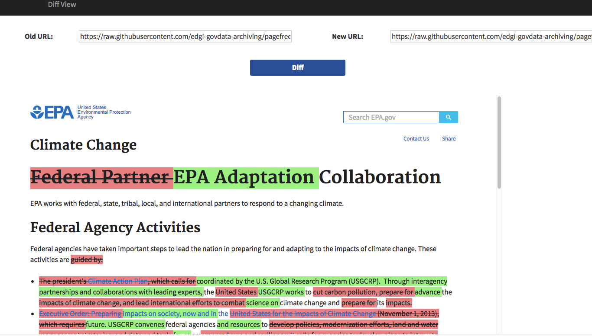

A node application with the following capabilities:
* Take 2 URLs as input and visualize their differences
* Take a formatted URL and return raw JSON from pagefreezer
* Take a formatted URL and automatically display a diff

#####Usage:
install the node dependencies with `npm install`, then
run `node app.js`

######Manual view:
access the main view at `http://localhost:3000`

Screenshot:

######URL Schemes:
Aside from the basic interface, a GET request may be made in the following formats:
`http://localhost:3000/diff?old_url=<one url>&new_url=<another url>&as=<view || json>`

A request that includes as=view will automatically run a diff and display the output. Otherwise, the service will return the raw JSON output of Pagefreezer
